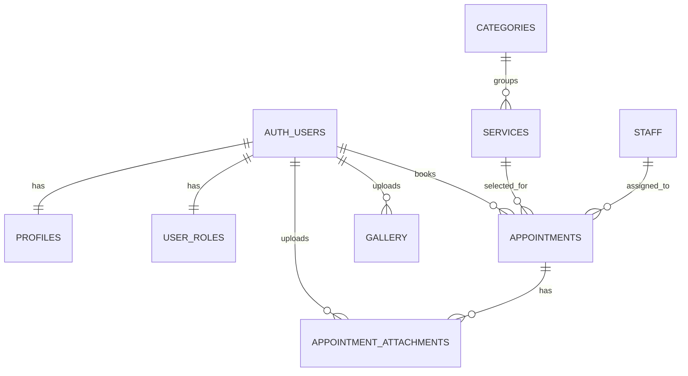

# Beauty Salon Web App

Beauty Salon is a multi-page web app for clients and admins.

- Clients can register/login, view suggested services and prices, create/edit/delete appointments, upload appointment attachments, and manage profile data.
- Admin users can access a protected admin panel to list/view/edit/delete appointments and list/view/edit/delete users.

## Project Description

The app helps a salon team and clients work from one place:

- **Public visitors** can access Home, About, and Contact pages.
- **Authenticated clients** can manage their own appointments and view service pricing.
- **Authenticated admins** can manage appointments and users through dedicated admin pages.

Core security is enforced using Supabase RLS policies (not only client-side checks).

## Architecture

### Front-end

- **Framework**: Vite (MPA mode)
- **Language**: Vanilla JavaScript (ES Modules)
- **UI**: Bootstrap 5 + Bootstrap Icons
- **Pattern**: Reusable shared components (header, footer, appointment editor, toast)

### Back-end

- **Platform**: Supabase
- **Auth**: Email/password authentication
- **Database**: PostgreSQL with Row-Level Security policies
- **Storage**: Private/public buckets (including appointment attachments)

### Technologies Used

- `vite`
- `@supabase/supabase-js`
- `bootstrap`
- `bootstrap-icons`

## Database Schema Design

Main tables and relationships:



Key domain tables:

- `profiles`, `user_roles`, `app_users`
- `categories`, `services`, `staff`
- `appointments`, `appointment_attachments`
- `gallery`

Migrations are versioned under `supabase/migrations/`:

- `20260221000000_initial_schema_with_rls.sql`
- `20260303120000_appointment_attachments_storage_rls.sql`
- `20260303133000_admin_users_panel_support.sql`

## Local Development Setup

### 1) Prerequisites

- Node.js 18+
- npm
- Supabase project (URL + anon key)

### 2) Install dependencies

```bash
npm install
```

### 3) Configure environment variables

Create `.env` in project root:

```env
VITE_SUPABASE_URL=https://your-project-ref.supabase.co
VITE_SUPABASE_ANON_KEY=your-anon-key
```

### 4) Run app

```bash
npm run dev
```

### 5) Build for production

```bash
npm run build
npm run preview
```

### Optional: Seed sample data

```bash
npm run seed:sample
npm run seed:reference
```

## Key Folders and Files

- `src/` — front-end source (all routes/pages/components)
- `src/components/` — shared UI components (`header`, `footer`, `toast`, `appointment-editor`)
- `src/pages/` — page logic and styles per route
- `src/services/` — Supabase access and business logic (`auth`, `appointments`, `admin`, `attachments`)
- `src/utils/auth.guard.js` — auth/admin route protection helpers
- `src/admin/` — admin HTML routes (dashboard, users, appointments)
- `src/appointments/`, `src/appointment/`, `src/profile/` — authenticated client flows
- `supabase/migrations/` — SQL schema and RLS migrations
- `scripts/` — data seeding scripts
- `vite.config.js` — MPA route inputs + dev 404 fallback behavior
- `package.json` — scripts and dependencies

## Available Scripts

```bash
npm run dev
npm run build
npm run preview
npm run seed:sample
npm run seed:reference
```
